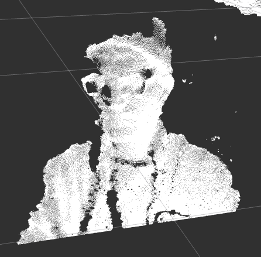

# apriltag-detection

This repo details all that's necessary to detect AprilTags using an Intel RealSense D435 Depth Camera.

Setup:
 - First, install the ROS wrapper for the RealSense D435 depth camera to your system: `sudo apt-get install ros-$ROS_DISTRO-realsense2-camera`. Note: Using the standard usb_cam package did not work for this camera, and made all images display depth info as green, and nothing else.
 - Clone this repository, and ensure the `apriltag` and `apriltag_ros` submodules have their contents downloaded with the commands `git submodule init` and `git submodule update`.
 - Set details of tags to search for in `tag_detection_pkg/config/tags.yaml`. We use the default tag family 36h11, but the specific IDs and real-world sizes of our tags must be specified under standalone_tags.
 - If the camera images aren't showing up, the `realsense-viewer` utility may be useful. This application starts an interface with the D435 camera that allows settings to be changed, firmware to be updated, and the RGB live feed to be previewed. If the camera feed doesn't show up, you likely need to install the proper drivers for your machine, or perform a firmware update on the camera.
 - The camera may need to be calibrated for apriltag detection.

Running it:
 - Run the launch file provided by the wrapper: `roslaunch realsense2_camera rs_camera.launch`. This sets the camera's base tf frame to `camera_link`, and several ROS messages are published to topics beginning with "/camera/...".
 - We must set a transform from a fixed frame to the camera frame. The default fixed frame in rviz is `map`, so we can satisfy this with the command `rosrun tf static_transform_publisher 0.0 0.0 0.0 0 0 0 map camera_link 100`. When we know the actual transformation, the zeros can be replaced with the actual X Y Z Y P R.
 - OPTIONAL: Now open rviz by simply typing `rviz` into the terminal. Click "Add", select "By topic", and choose "/camera/color/image_raw" Camera to see the RGB image, and/or "/camera/depth/image_rect_raw" Camera and DepthCloud to see the image with depth information, and this depth projected on the 3D vizualizer, respectively.
 - Start apriltag detection with our copy of the provided launch file: `roslaunch tag_detection_pkg continuous_detection.launch`. The camera topic can be changed on the command line by appending the arguments `camera_name:=/camera/color image_topic:=image_raw` to the roslaunch call (args shown are default, and work for the D435).
 - OPTIONAL: `rosrun rqt_image_view rqt_image_view` opens an image viewer that allows the image topic to be selected from all available. This is an easy way to see detected tags overlaid on the camera feed by selecting the "/tag_detections/image" topic.
 - OPTIONAL: `rosrun tf tf_monitor` can help determine names and connections between published TF frames.

